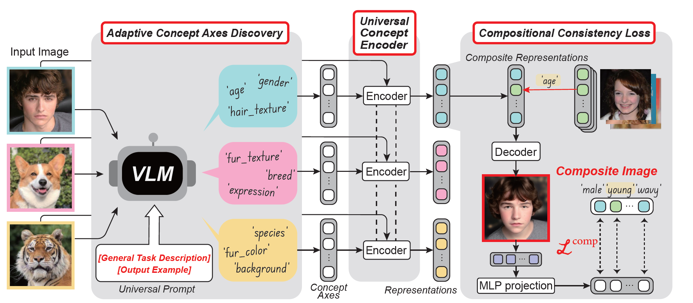

# Bridging the gap to Real-World-Language-Grounded-Visual-Concept-Learning
This is an official implementation of the paper : \
**Bridging the Gap to Real-World Language-Grounded Visual Concept Learning (NeurIPS 25)**\
Whie Jung, Semin Kim, Junee Kim, Seunghoon Hong

## To be updated
